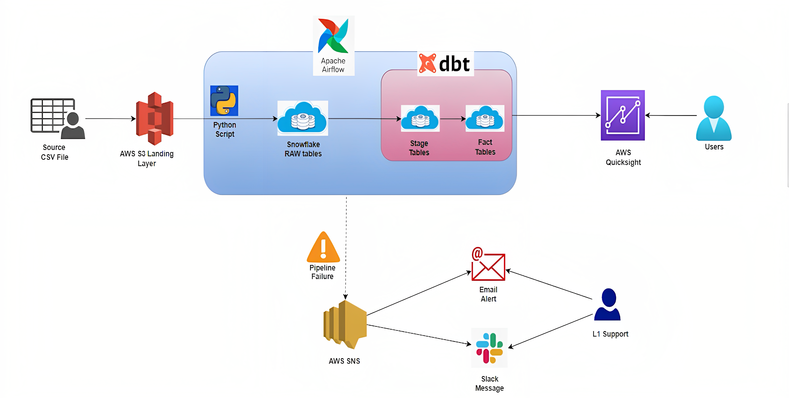

# ETL Pipeline with DBT, Snowflake, and Airflow

This project will help you understand how to construct an ETL (Extract, Transform, Load) pipeline using DBT (Data Build Tool), Snowflake, and Airflow.

## Overview

In this project, we will build an ETL pipeline using technologies such as dbt, Snowflake, and Airflow. By using these tools we'll enable seamless data extraction, transformation, and loading. Additionally, the project focuses on implementing efficient monitoring through Slack and email notifications using AWS SNS (Simple Notification Service). The objective is to gain a comprehensive understanding of dbt, Snowflake, Airflow, and AWS SNS, while demonstrating proficiency in building scalable and efficient ETL pipelines for data transformation and modeling.

## Tech Stack

- Language: Python, SQL
- Tool: DBT
- Database: Snowflake
- Services: AWS EC2, Airflow, AWS SNS

## Steps

1. Install Airflow and DBT on an EC2 machine to set up the development environment.

2. Configure the Postgres network settings and install Airflow.

3. Set up Airflow's configuration and clone the necessary repositories from Git(Refer to my repository).

4. Test the Airflow environment to ensure proper functionality.

5. Add Airflow parameters and create sensors to monitor data availability.

6. Test the S3 sensors to verify successful data ingestion.

7. Configure the DBT environment and customize the profiles.yml file to connect to Snowflake.

8. Next, add a DBT task to the Airflow DAG for data transformation.

9. Add fact and dimension Airflow tasks to load transformed data into Snowflake.

10. Incorporate test cases in the pipeline to validate the accuracy and quality of the transformed data.

(Understanding the fundamentals of DBT, including its significance and role within the ETL process helps).

## Architecture Diagram

